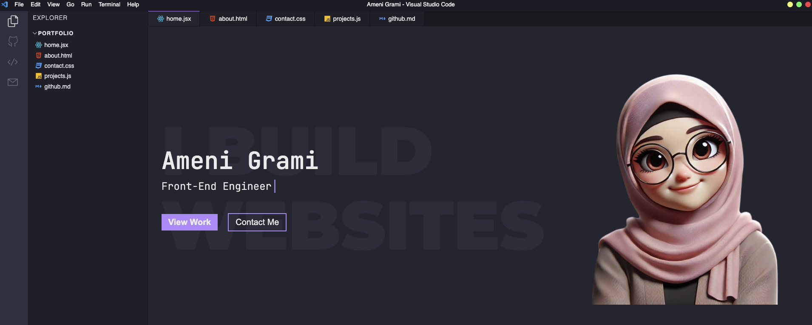

# Hi, I'm Ameni Grami 👋

## Frontend Engineer 💻

Welcome to my GitHub profile! I'm a passionate Frontend Engineer with expertise in building modern, responsive, and user-friendly web applications. I love turning ideas into reality through clean, efficient, and scalable code.

### 🛠️ Technologies & Tools

- **Frontend Development**: React.js, Next.js, TypeScript, JavaScript, HTML5, CSS3
- **Mobile Development**: React Native
- **Tools**: Git, GitHub, VS Code, Figma, Webpack, npm/yarn
- **Other Skills**: REST APIs, GraphQL, Responsive Design, UI/UX Principles

### 🌟 Featured Projects

- **[Messagera](#)**: A messaging platform that helps businesses communicate timely and effectively with their customers..
- **[Delice](#)**: Delice Backoffice uses Dixie DB for offline milk stock management, allowing continued operation without a network. When a connection is available, it automatically synchronizes data from Dixie DB to the online database, ensuring consistency across systems..
- **[RentalSaga](#)**:The backoffice system manages the creation of car rental agencies, allowing each agency to handle its fleet of vehicles for rent. It provides tools for tracking available cars, managing reservations, and ensuring smooth rental operations, streamlining the overall management process for agencies.
- **[TakiAcademyAdmin](#)**:The backoffice system manages an educational website, overseeing content, user enrollment, and course administration to ensure seamless learning experiences.
- **[WeQuizz](#)**:Innovative Teaching, Seamless Quizzes .We Quizz makes it easy for educators to craft quizzes that captivate students and promote deep understanding.
- **[imtiyazacademy](#)**:Imtiaz is a Mauritanian platform offering remote national curricula with interactive exercises, regular tests, and experienced teachers, providing flexible and secure learning anytime, anywhere.
- **[ostedhy](#)**:Osthedy is a Tunisian platform offering remote national curricula with interactive exercises, tests, and experienced teachers, enabling flexible, secure learning anytime, anywhere.

### 📂 Repository Highlights

- **[about.html](#)**: Learn more about me and my journey.
- **[contact.css](#)**: Styling for my contact page.
- **[projects.js](#)**: JavaScript logic for my projects section.
- **[github.md](#)**: My GitHub workflow and best practices.

### 📫 Let's Connect!

I'm always open to collaborating on exciting projects or discussing new opportunities. Feel free to reach out to me:

- **Email**: [amenigrami489@gmail.com](mailto:amenigrami489@gmail.com)
- **LinkedIn**: [Ameni Grami](https://www.linkedin.com/in/your-profile)
- **Portfolio**: [View Work](https://www.linkedin.com/in/ameni-grami/)

### 🖼️ Profile Image

---

⭐️ From [Ameni Grami](https://github.com/Ameni102Grami)
